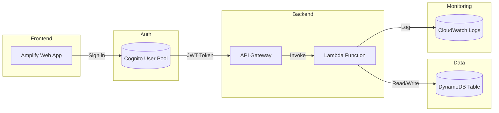

## 🚀 Serverless IaC Deployment with Terraform (AWS Lambda + API Gateway + DynamoDB)

This project demonstrates how to build and deploy a fully serverless REST API on AWS using Infrastructure as Code (IaC) with Terraform.
It covers compute, API, database, IAM roles, authentication, and CORS — all provisioned automatically.

## 🧩 Serverless Architecture

## ⚙️ Technologies Used

| Component | AWS Service | Description |
|------------|--------------|-------------|
| **Frontend** | Amplify / S3 | Static web hosting with HTTPS |
| **Authentication** | Cognito | OAuth2 / JWT user management |
| **API** | API Gateway (HTTP) | Public REST API with CORS and auth |
| **Compute** | Lambda (Python) | Stateless serverless compute |
| **Database** | DynamoDB | Serverless NoSQL table for users |
| **Monitoring** | CloudWatch Logs | Lambda logging and metrics |
| **Infrastructure** | Terraform | Infrastructure as Code (IaC) deployment |

